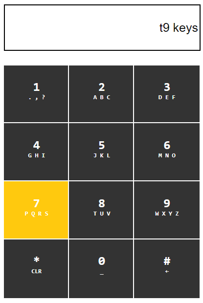

# T9 Keyboard

A simple web page emulating the famed T9 keyboard. See it live [here](https://zbhavyai.github.io/t9-keyboard/).

## Features

+ Can be used via clicking onscreen buttons or using key strokes on the keyboard

+ Typos can be deleted using `BackSpace` or clicking `#` button multiple times

+ Complete text is cleared via `*` button or `Delete`

+ Pause for 1 second to enter characters from the same button again

## How to run

1. Clone the repository on your machine

2. Open the [index.html](index.html) file in your browser

## Screenshots

